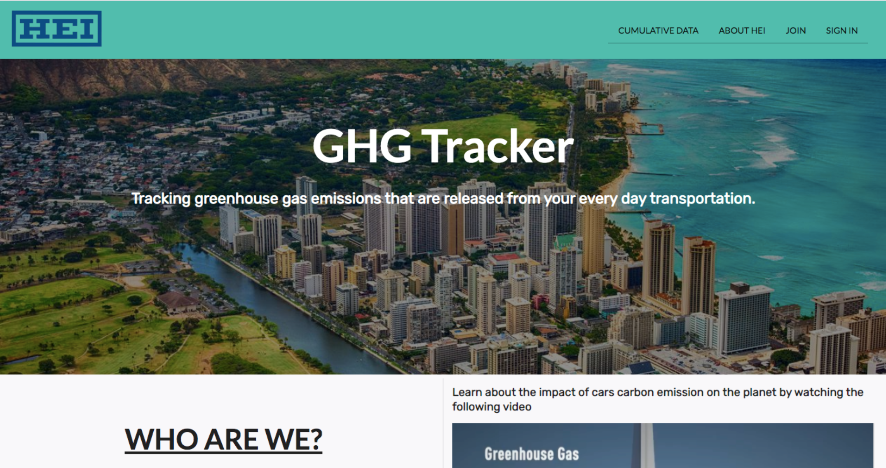

 

## Overview
For this semester's ICS 414 Software Engineering II class, we were assigned one major project in groups of 8 to 9 for the entire semester. We were task to create a greenhouse gas tracker website with Hawaiian Electric Industries, where it allows users to store their commutes and mode of transportation. In return, using the inputted information determines how much greenhouse gas they either produced or reduced. Alongside this main concept, we also added other aspects such as cumulative components for both individual users and all users. 

What made this a unique project was that we were fully online. We never met in person, and our only form of communication was through discord, a messaging and talking platform. It took a while for us to get moving, especially during the planning phases where we discussed the direction and layout of this project. This experience showed me the importance of having project management and communicating efficiently together. In addition, we were encouraged to meet at least twice a week to discuss the current progress of our milestone. This ensures constant planning and preventing overlaps and merge conflicts. It may seem tedious, but all these factors played a huge role in the completion of our project. 

Other than coding, we also presented our website and progress to the class and during customer meetings. During this process, we received a lot of feedback and useful concepts that we can incorporate. I think this was a great experience, especially since many jobs require software engineers to present. It was also amazing to see other groups and their ideas outside of the main concept of tracking user’s commutes. 

## Comparison to ICS 314
Compared to the ICS 314 Software Engineering I class, we focused more on the detail of our code. We would have review meetings where we looked at a file, and compare it side by side to our checklists. These checklists ranged from architecture and design to javascript and react. This process showed us the best practices when coding. One thing that was emphasized was the preference for functions instead of classes for stateless components. Through functions, I learned a lot more about react such as hooks, and how to incorporate them in my code. Another comparison to ICS 314 was that we were more independent. Many of us discovered different libraries and packages that simplified our code or made our website stand out. This opened my eyes to the endless possibilities that one can do. 

