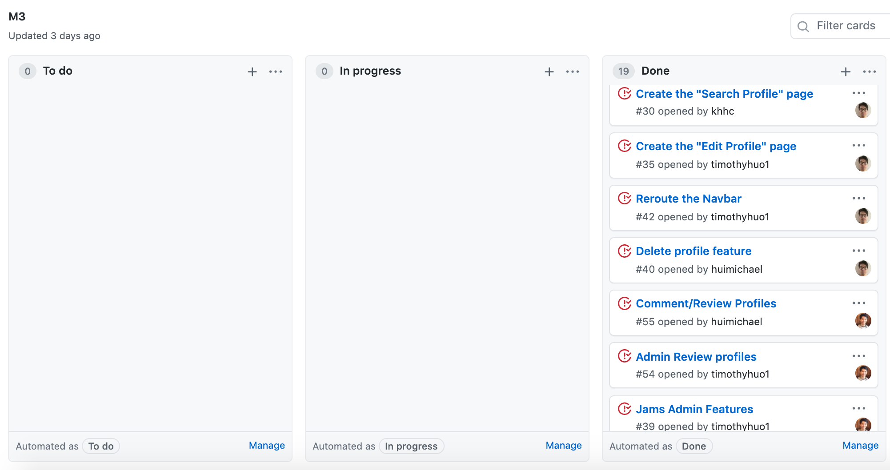

Looking back at my semester in software engineering, I never expected to learn so much in web applications and fundamental concepts. During the summer, I became interested in web design and watched tutorials on front-end development. This was only the beginning as my software engineering class helped me get to the next level, not only in advanced applications but also in fundamental concepts that are key in software engineering. Through this experience, some concepts that I acquired are coding standards, user interface frameworks, and agile project management.

## Coding Style
When writing a paper, correct grammar and conventions goes a long way. This style benefits those who are reading it and helps them better understand your paper. It is very similar to coding, where tracing someone's code might take a while because of poor organization. That's why I believe Coding standards make things easier for others and yourself. Coding standards are a way to organize and help a person code in a consistent matter. Your code tells a lot about that person, and hirers look that. Just like your resume, how you organize your work could shift a hirer's opinion of you. I believe that coding standards are a tool that all software engineers should have. During my semester in software engineering, I learned to use ESLint. ESLint is a coding standard tool that detects warnings and errors in your code. This tool has probably saved me hours of debugging. At first, these indicators get a bit annoying, but you start getting used to the format, such as putting a space before every bracket. I would recommend learning coding standards, especially for beginners, as it helps you get used to strict notations in languages, like case sensitivity and correct spelling. More importantly, coding standards help prevent repeated errors from happening. In my final group project for software engineering, we had to work together to create a website. At first, we thought this would be very troublesome trying to understand what someone coded. However, ESLint made understanding each other's code simpler and helped us work together. There are many tools out there that will take time to learn but will pay off in the long run. 

## Frameworks 
What's great about web design is with a couple of skills like HTML and CSS, you can create a whole page. Just with HTML and CSS, users can structure and design web pages. However, complex ideas will take more time to build and function. For example, the first time I was trying to build a dropdown navbar, it took me hours to get the functionality working. However, user interface frameworks completely changed how I code. UI frameworks are defined classes and interfaces that create responsive layouts. Many options are provided by UI frameworks that expand the user’s capabilities. With UI Frameworks such as Semantic UI and Bootstrap, building a dropdown navbar could take less than half the time and effort if you use HTML and CSS.  Some websites help guide what different classes do and how to best incorporate them into your projects. Ever since I learned about these UI Frameworks, I have used them in every project. Learning a framework on top of HTML and CSS is significant when creating huge projects. Not only saving time and trouble but also shortens and organizes code. 

## Project Management 
As mentioned before, it is difficult to work effectively with others in a web application project. As a team, you want to minimize overlap in work between group members. Meaning that you do not want to depend on someone's progress. There will be instances where group members overwrite each other's code and people working on the same problem, which results in someone throwing away their work. Instead, the most effective way is to work parallel with each other. To do this, project management is highly recommended to structure and coordinate what to do and when to do it. A simple project management style is Issue Driven Project Management. Issue Driven Project Management is a straightforward solution to solving these problems, as you don’t have to spend much time planning it out. In project management, each member should have a task that they are working on and know what task to do next. This image is an example of Issue Driven Project Management in my final group project for Software Engineering. Showing how everyone has their own task and the progress. 

Along with this structure, group members should meet 2-3 times a week to discuss the progress of the milestones, to prevent someone from waiting for a task. In this way, there will be constant planning and a clear representation of the project's current state. Even though this project management style is directed towards web applications, I can see myself using this style, either in school or with side projects. Recently, I have been doing a lot of social media for clubs and my family business, and implementing this style would save confusion and time when working with others. Especially when you are thinking about what and when to post, it is important to effectively plan out what each member of the group tasks are and not greatly depending on others. 

These software engineering concepts can be overlooked, but they play a huge part in web application development. And many of these ideas and concepts could be applied outside of software engineering. From how you organize your code and manage your project, the benefits outway the time spent learning it. In this semester, I have probably saved hours and hours of time and effort from using these software engineer concepts, and I am excited to apply them in my projects.
 
