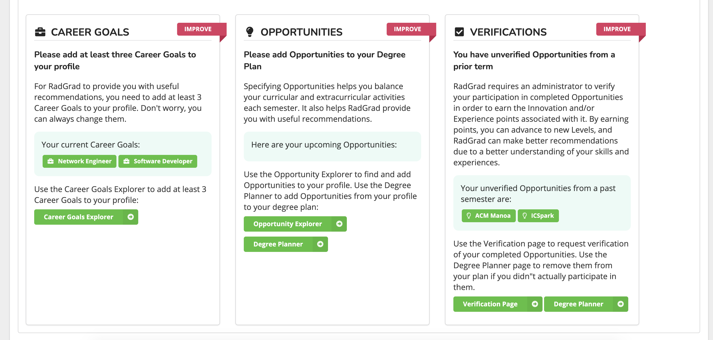
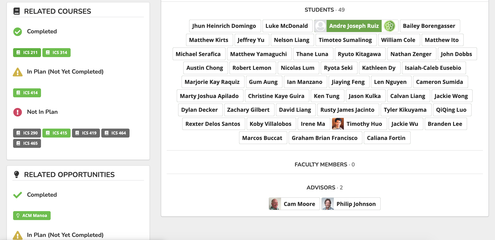
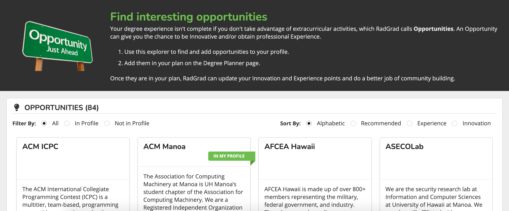
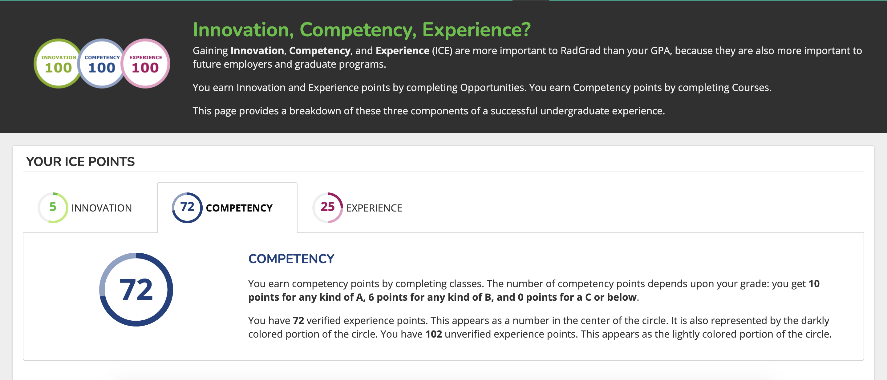
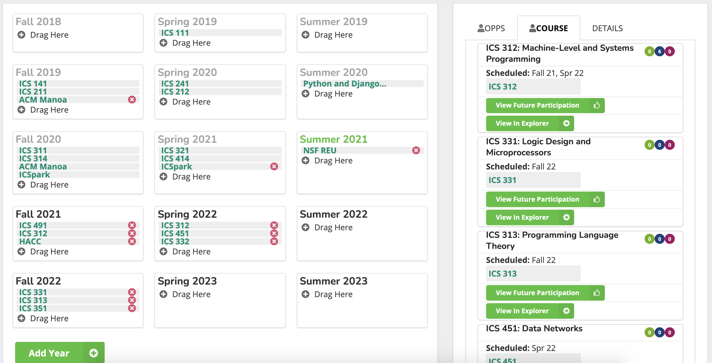
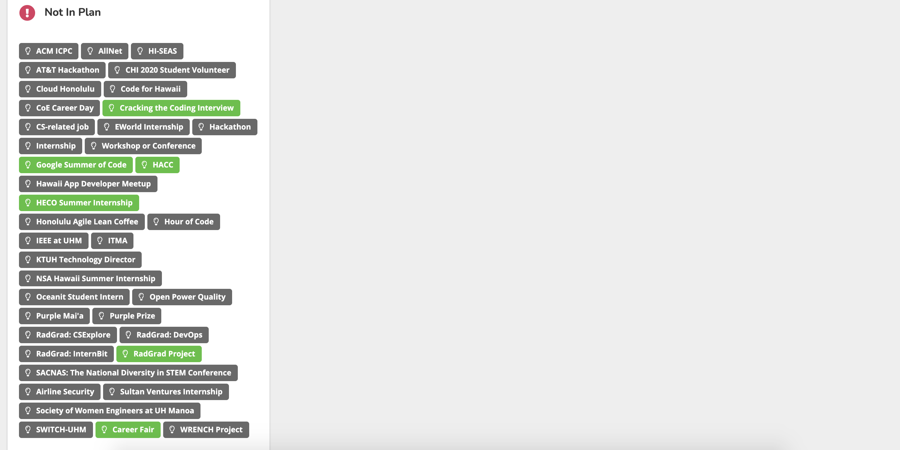
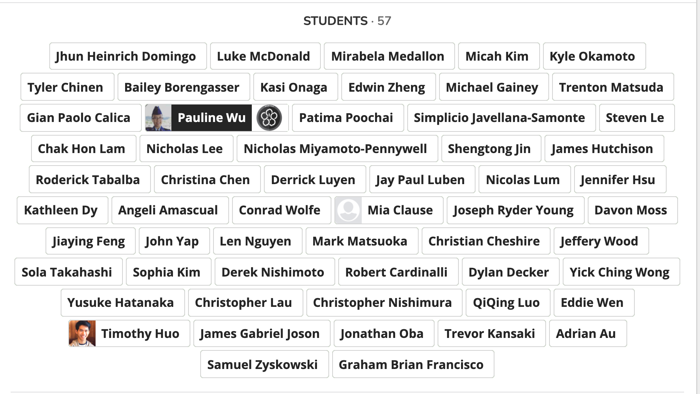
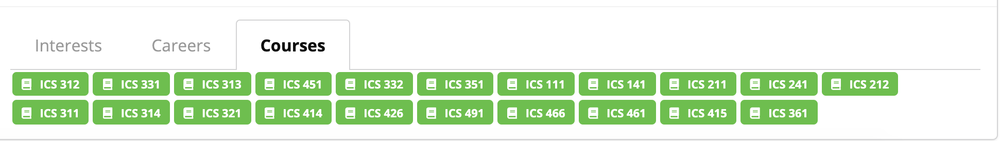

Deciding what you want to pursue for the rest of your life is a difficult choice to make. Going into college, I wasn’t too sure what computer science was. Luckily, I was introduced to RadGrad during my first semester of college. RadGrad provides a platform to help individuals find and develop their interest in computer science. It presents an alternative to the basic GPA with ICE (Innovation, Competency, Experience). These components help shape an individual to become a more well-rounded computer science student. RadGrad is still an ongoing project and I will be going over the strengths and weaknesses of the current version of RadGrad.  

# Strengths

<b>To-Do List</b>

RadGrad does a great job of breaking down the functionality of the website so you aren’t overwhelmed. The Personal To-Do List is a very helpful feature, especially for those who are first using the site. It organizes all the tasks into groups depending on priority and provides a good indication of what is needed to be reviewed again. When I was addressing the high and medium priorities, it showed me my current information without having to visit that page directly. For example, my Career Goals had my current ones being displayed on the card and it asked me to review them since I haven’t within the past three months. It is neat that the system reminds you to continue to review and update career goals and interests as they change. These changes can impact other parts of the page positively, like my recommended opportunities. Everything is laid out for you in a compact format and it only takes a few clicks to explore all that RadGrad has to offer. 

<b>Relationships Between Interest, Courses, and Opportunities</b>

In the field of Computer Science, there are so many areas of interest, and opportunities that come with them. RadGrad helps minimize the amount of effort in finding opportunities relevant to interest or course. The design of the Interests and Courses page not only tells the user what certain sections are about but also all the related opportunities. This is also reflected in the opportunities page, wherein each opportunity shows all the related courses and interests. These features can be used to plan out what to pursue and help make college more enjoyable. 

Looking through the Opportunities page, there were a lot of options to choose from. At first, it may seem difficult to find a certain opportunity that the user might be interested in, but RadGrad solves this by adding options to filter and sort by certain requirements. Instead of looking through the whole list of opportunities, these filters allow users to narrow down their choices. One filter that I found interesting was the Recommended, where it filters all the opportunities depending on my existing information.     

<b>A Scale for Success</b>

RadGrad emphasizes that GPA is not the only factor that is important to a computer science student. They implemented a system called ICE, which measures innovation, competency, and experience from courses and opportunities. I feel that this system leads computer science students in a better direction. When trying to find a job, your prior experiences play a huge role in the hiring process. This system encouraged me to do other extracurricular activities and to explore what the community has to offer. 

# Things to Look At

<b>Planner Page</b>

For the Planner page, it seems like everything in the planner is very compact, and I had trouble trying to drag the correct opportunity/course to a different semester. It is difficult to hover over the opportunity/course when trying to show the indication of what the class is, or how many points that opportunity is worth. For the right side, the opportunities and courses that you have continue to extend down the page, I think having a scroll bar here would be an improvement.

Errors:
- There are duplicate courses 
- For some courses, it shows 0 for all innovation, competency, and experience. 

<b>Blank Spaces</b>

The formatting of a page when there is a lot of tags can create unnecessary blank space. The example in the image above shows the course page to Introduction to Programming for the Web (ICS 415). In the Not In Plan section on the left side, there is a list of opportunities that are related to this course. However, this leaves a huge blank space on the right side because there are no course reviews. Even if there were course reviews, the Not In Plan tags will overwhelm the other sections on that left side. Adding a dropdown menu or a view more button would minimize the page length and space.

<b>Organization</b>

When users check off certain visibility control, this is reflected in the interests and career pages. For example, the image above shows that certain student tags stand out, like having an image or showing their RadGrad level. This should be consistent, by only showing first and last names. 

When you check off courses in the visibility control, the courses should be sorted by course number.

<b>Suggestions</b>

- A nice addition to filters on the Opportunities page would be searching by interests or even name. This allows users to display only what they want to see, similar to the recommended filter.
- Looking at the navbar, some pages could be combined to shorten the length of the navbar. For example, combine the ICE and Levels pages or create a dropdown feature for them. 
- RadGrad has a lot of pages and great functionality that some new users might overlook. I think having an assist feature will be helpful. 
