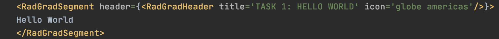

Research Interns at RadGrad2 were tasked to complete practice exercises to get familiarized with the RadGrad system. This is my experience with this task and the problems I faced.

# Task 1: 

For Task 1, we started off with a simple exercise that many coders are familiar with, which is “Hello, World”. In this task, we had to display Hello World using RadGradSegment and RadGradHeader components. For segments in the RadGrad system, the style is an icon on the left side of the title and black line separating the title and body.  

This was my first time using fomantic-ui to find the icon needed for this task. The advice and hints I got from the session helped me complete this task smoothly. Here is the code:

