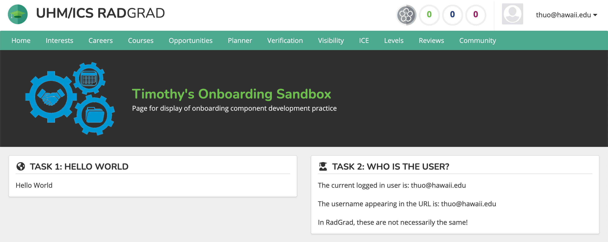
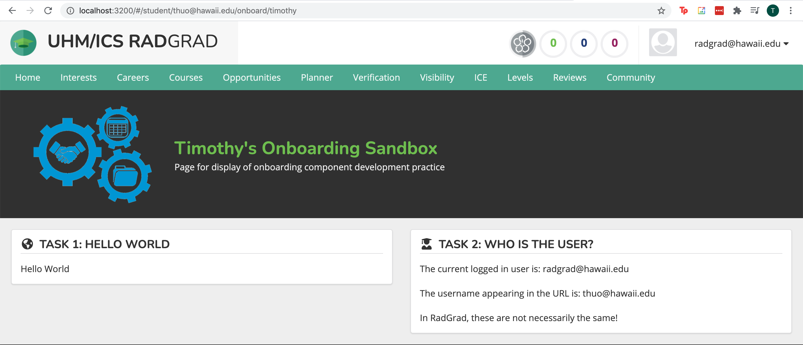
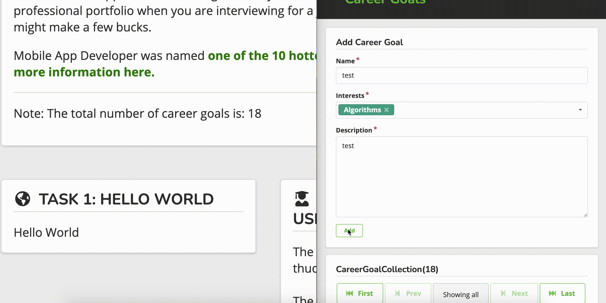
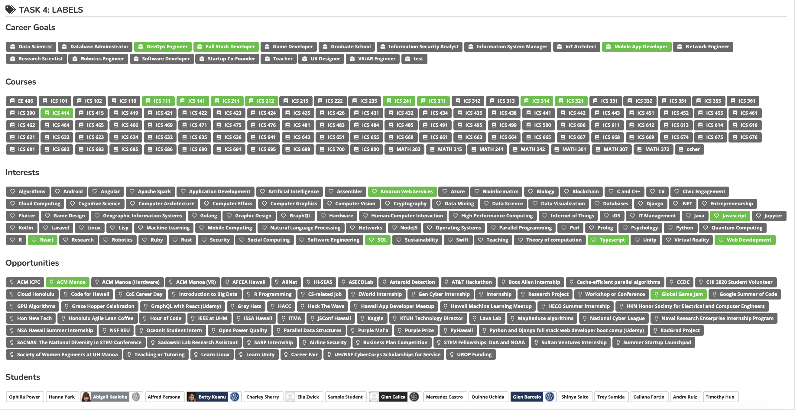
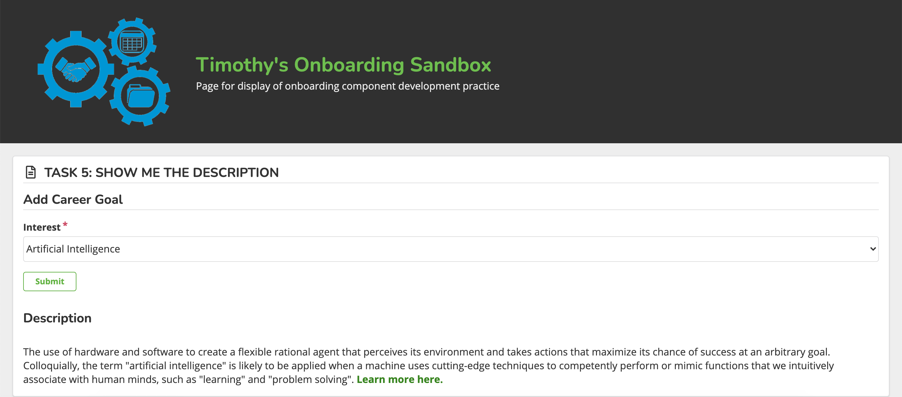
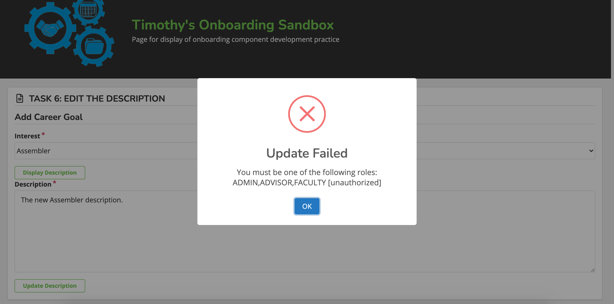
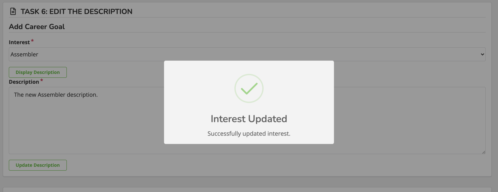

This summer's Research Interns at RadGrad2 was tasked to complete practice exercises to get familiarized with the RadGrad system. This is my experience with this task and the problems I faced.

# Task 1: 

For Task 1, we started off with a simple exercise that many coders are familiar with, which is “Hello, World”. In this task, we had to display Hello World using RadGradSegment and RadGradHeader components. For segments in the RadGrad system, the style is an icon on the left side of the title and black line separating the title and body.  


This was my first time using fomantic-ui to find the icon needed for this task. The advice and hints I got from the session helped me complete this task smoothly. Here is the code:

```<RadGradSegment header={<RadGradHeader title='TASK 1: HELLO WORLD' icon='globe americas'/>}> Hello World </RadGradSegment>```

# Task 2:

For Task 2, we are creating another RadGradSegment detailing the user who is currently logged in and the user that appears in the URL. The one challenge that I had was getting the username in the URL. With the help from other interns, I was directed to a hook called UseParams that grabbed the username in the URL. 

``` const { username } = useParams(); ```

Same user logged in:



Different user logged in:



# Task 3:

For Task3, we had to create another RadGradSegment presenting MiniMongo data. In the segment, we had to display a random career goal and the number of career goals that the system has. By accessing the CareerGoals collection using withTracker, I found the total careers in the system and randomized the display. Using Robo3T made my life easier as I was able to find the collection and properties I was looking for. Some useful commands that I learned were command-shift-F that searches a string in the selected directory and command-b that goes to a page that defines the function that I highlighted. 

Here is a gif showing a new career goal everytime the page is refreshed:
 

Here is a gif showing reactivity with two users:
 

# Task 4
For Task 4, we created a RadGradSegment containing all labels in the system. To get familiar with labels, I read through the Entity Labels page on the RadGrad documentation and looked through other pages in the system that used these labels. To get the collections, I used findNonRetired() that returns the non-retired documents. Then map through them to return them as labels with the associated slug or profile ID. After getting the first set of Career Goals labels to display, the rest were very similar.  



# Task 5
For Task 5, we created a form to control what’s displayed on our page. I have used Uniforms in the past but not with react hooks. Setting up the form was similar to what I learned in Software Engineering I. For the dropdown, I set the allowed values to an array of the Interests names. It took me a bit to understand react hooks. After storing the selected interest, displaying the description was just like Task 3 with markdown. 



# Task 6
For Task 6, we continued with Task 5 by adding another field that updates the database. After selecting an Interest and clicking on the Display Description button, a text field would appear that allows you to edit the description. This task was the trickiest for me, and I would like to revisit and update my code because I believe there are simpler ways to do complete this task than what I did. The biggest trouble I had was passing the selected Interest to my Task6EditDescription component where my other form would be located at. I tried using other interfaces but ran into trouble. I decided to just pass the interests name and description and in my Task6EditDescription component call updateMethod.callPromise. 

This image shows a student trying to update the description of an interest. 


This image shows an admin trying to update the description of an interest.



