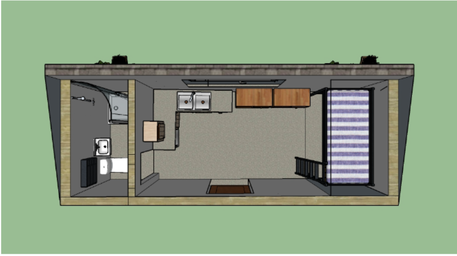

## The Development of Designs 

During my junior and senior years of high school, my engineer classes tasked us with designing and making models of tiny houses. We focused heavily on tiny houses because of the living conditions in Hawaii, where living cost is high and space is limited. Also, these concepts could be incorporated into dorming for students or the homeless. Throughout this experience, I made dozens of house blueprints and digital/real-life models. What made this difficult, yet a special project was not only was space limited, but we had to incorporate environmentally friendly designs. My group research template ideas for saving space and one common idea was using utilizing the height of the tiny house. Such as bunk beds where the bottom portion became a desk, a ladder to a loft, or having staircases and using the space underneath as storage. We use these template ideas and modified them to our liking. This concept is very similar to design patterns. Design patterns are solution templates discover by people that solve common problems. Many design patterns are used in software design that may seem unnoticed. Like designing a tiny house, there any advantages and disadvantages when using templates depending on the situation. When we in the designing phase of the house, one of the things we considered was different types of roofing. To solve our requirement of incorporating environmentally friendly designs, we use template ideas of roofings to best utilize gutters and solar panels. Just like design patterns, these ideas might be too complex to implement, but in the long run, it helps accomplish our goals.  

## Templates in Software Design
In software design, there are design patterns that can be used in many different situations. These situations or problems usually occur oftenly and these design patterns act as a reusable solution. Similar to blueprints, there are templates that you can use to solve certain problems. When describing a design pattern, it shows the relationship between classes or objects. The consequences are also brought up and what problems could happen due to these design patterns. Some common design patterns that I have used in my code are singletons and observer design patterns. 

A singleton provides a global variable to languages that don’t support global variables. This can be useful when manipulating data in another file. However, it is not recommended to have a global variable in general and singleton design pattern may not be thread-safe. In my final group project for a software engineering class, we are designing a website that helps those who are interested in music to connect and come together. We used singleton design patterns to help access collections such as instruments and interests, which helped us manipulate these data in our forms, and when we display them. 

Another design pattern is observer, where you have an object representing the subject that maintains a group of dependents. When that subject-object changes in state, then the dependents will react. The disadvantage to the observer design pattern is that it can lead to issues such as race condition, where you have two or more threads operating at the same time, accessing and changing the same data. Also, all these dependents that react to a subject’s change will be more difficult to debug. A common example of this design pattern is the event handler. This appears with forms, links, etc. where you have an action, such as clicking a button and the dependents will react to that action. An example of this case in our project is to publish and subscribe. Where we publish collections and subscribe to them to receive the information in the collections. These changes independence can occur at runtime.     

In the world of software engineering, using and understanding design patterns are important. Before I even knew what design patterns meant, I was already using common design patterns in projects. And, there are many more design patterns than the ones I mentioned. Just like designing a tiny house, knowing how to use these templates helps solve common problems and helps you get started.
