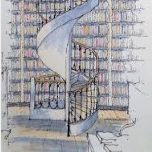

## Beginning of the Journey

Coding is seen as a reading and writing system across the world. Under the broad definition of coding, there are many languages with different syntaxes. Going into the computer science with little knowledge, I never image how many tools and information are out there. I spent my year in computer science learning the basics of coding, in languages such as java and C/C++. We were tasked with solving small problems over and over again, but never really amounting to any large projects.

## Branching Off

Going into my second year, I registered for Software Engineering 1. In this class, students were expected to have experience in coding and be able to pick up information fast. Currently, this is my first week and right off the bat, we were task to pick up Javascript and be familiarize enough to start solving small problems. Compared to Java and C/C++, Javascript is more flexible and provided tools to help solve problems that I never thought of. It gives more freedom to software developers and bends the rules of strict languages. When I approached ES6, I learned notations and keywords that were unique. Such as, arrow notation for functions and representing primitive types as one variable made things more organize and neat. Looking at a software engineering perspective, I believe javascript is a useful language that can be picked up faster than other languages. 

When solving small problems with Javascript, I found it to be exciting as there are even more ways of solving a problem. What was different about this and previous experiences is that we were timed. This adds more pressure and a new challenge for me. I think this is a great way of understanding where you are and what things to improve on. Software engineering opens up a whole new library of possibilities and I’m ready to take the next step. 

<!-- https://www.pinterest.de/pin/399835273172695999/ -->
