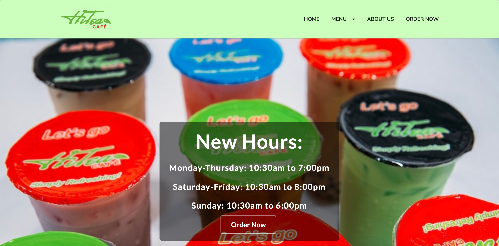
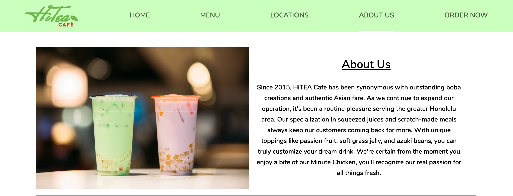

HiTEA is a local family-owned business that serves boba and Chinese food here in Hawaii. I created a website to help customers stay in touch and provide more information behind HiTEA. Also, have an option to order online with the Clover POS. 
This project was created using web development and frameworks such as Semantic UI. The static website is hosted using Amazon S3 buckets. Also, through Amazon CloudFront to secure the website (SSH certification). 

This project helped me understand how a website works and showed me the endless possibilities of web design. In this project, I improved my web application skills and discovered helpful tools on the internet. This project is still a work-in-progress, as there are still so many things I want work on. 

Here is the [Website](http://hitea808.com/) and Github [Repo](https://github.com/timothyhuo1/HiTEA) 

