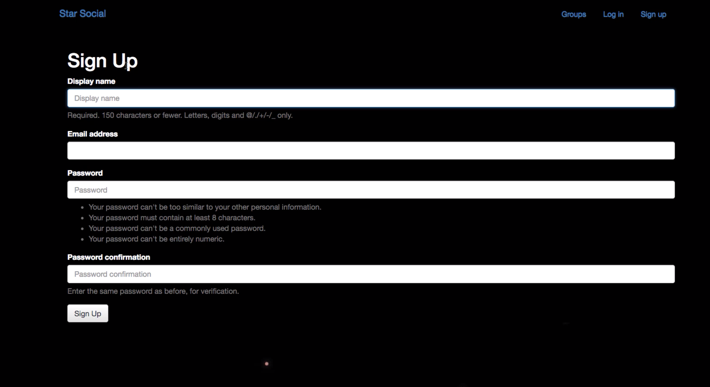

This social clone website was taught on a Udemy course on Python and Django Full Stack Web Developer BootCamp, created by Jose Portilla. In this project, it took ideas from other social sites and created a community site for outer space. I practiced using Django and its tools, such as models, views, and templates. Creating functions such as users and groups, users can create, join and leave groups, and post forums and replies in those groups. All the information is stored on Django's admin page, in this case, hosted locally.

This was the final project to this course, and it implemented and combined all the topics in the course (HTML, CSS,javascript, bootstrap, jQuery, Python,Django). Even though this was an outdated course, this project helped me learn how a full-stack web application worked and gained experience in skills that can make development simpler.
