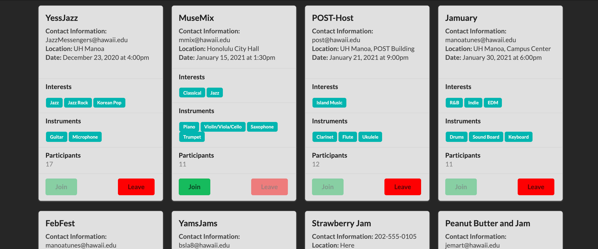
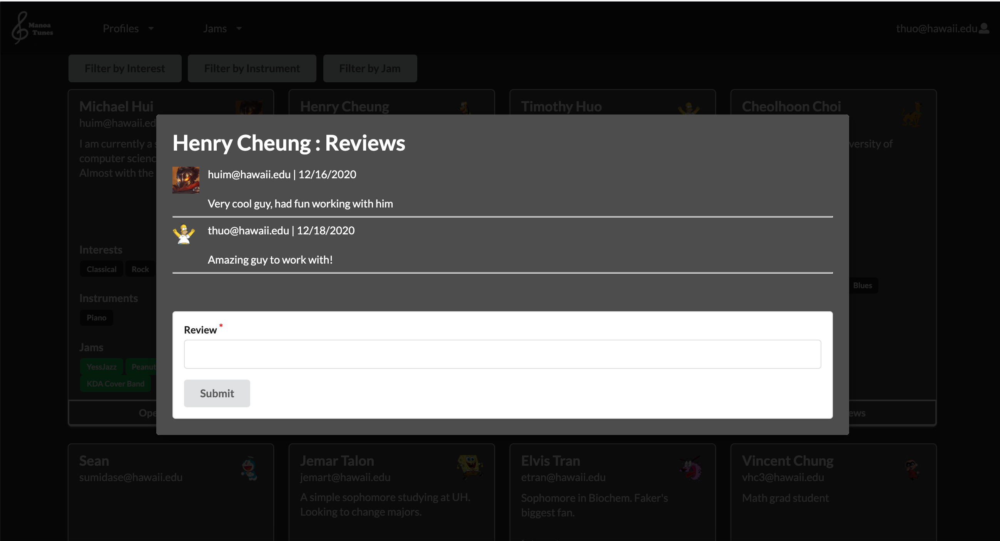

Like many others going into college, we had to sacrifice most of our hobbies to focus on school and our future. For me, it was playing music. At one point in high school, music was one of the most important aspects of my life. Throughout my experience playing music, I have developed bonds with my peers and teachers. Even though I stopped playing, I still enjoy listening to music. It was not until this project for my software engineering class that sparked my interest again. My group worked on a final project called Manoa Tunes to help students and faculty connect and share with music. Many students like me would like to express our musical creativity, and our group wanted to provide a platform to do so. 

Our two main focuses were profiles and jams. We wanted to let students have their own profiles, and display their biography, musical interest, and instruments they play. This resulted in multiple collections, which allowed us to filter profiles with certain information. Also, we wanted to implement a review section for each profile. In terms of jams, the format was similar to profiles, however different functions such as allowing users to join and leave jams. My main task was completing the review sections and the majority of the jams. A challenging aspect at first was communication among everyone. In some cases, we overlapped with each other and we weren’t being as efficient. Once we were all on the same page, we started to overcome obstacles such as understanding how collections worked and how to manipulate them in other pages. This was very helpful when we were discussing and working on solving bugs with profiles.  As a result, I was later able to avoid those possible errors and complete jams in a timely manner. 

Here is a link to [Manoa Tunes Github Repo](https://github.com/manoa-tunes/manoa-tunes). For more information visit our github [page](https://manoa-tunes.github.io/).

This image is the jams page, I implemented cards that display information about jams and buttons that allow users to join and leave them. On the admin side, I worked on deleting the jam cards. 
 

This image is the comment feature, I implemented a button that allowed you to write reviews about a person. On the admin side, I worked on deleting the comments. 
 
Manoa Tunes was my first software engineering project, and I’m lucky to have worked with these group members. Along the way, I picked many skills, such as issue-driven project management, which helped us stay organized and on track. Also, other tools we picked up like Robo 3T and Semantic played a big part in how much we accomplished. Taking effort into these skills and tools saved us tons of time. 
